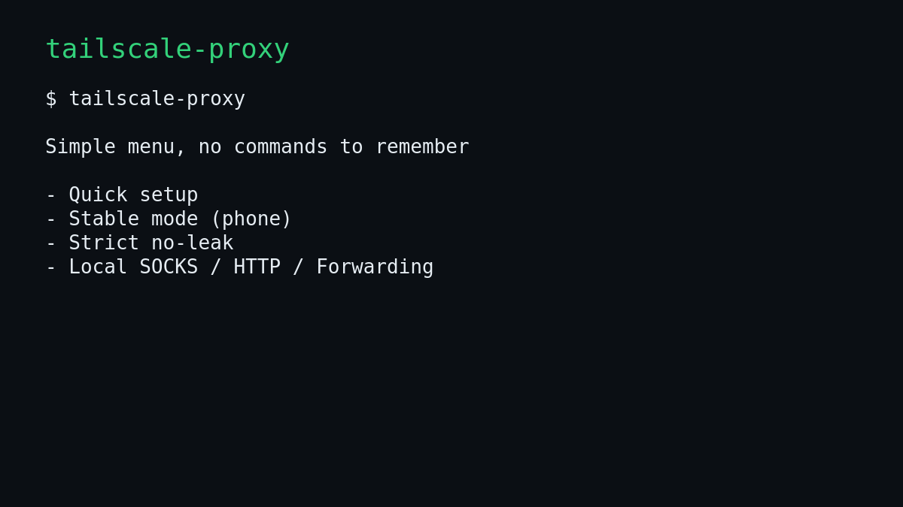

<div align="center">

# tailscale-proxy

**Friendly CLI wizard for 9proxy + Tailscale transparent proxying**

[](https://www.python.org/)
[](LICENSE)
[](https://github.com/zahidoverflow/tailscale-proxy/commits/main)
[](https://github.com/zahidoverflow/tailscale-proxy/stargazers)
[](https://github.com/zahidoverflow/tailscale-proxy/issues)

<br>



<br>

[Installation](#installation) •
[Features](#features) •
[Quick Start](#quick-start) •
[Commands](#commands) •
[Documentation](#documentation) •
[Contributing](#contributing)

</div>

---

## Why tailscale-proxy?

Setting up transparent proxying with Tailscale exit nodes is complex - it involves iptables, redsocks, systemd services, and careful configuration. **tailscale-proxy** handles all of this with a friendly interactive wizard.

- **Zero config headaches** - Interactive prompts guide you through setup
- **Safe by default** - Tailnet-only binding prevents accidental exposure  
- **Smart auto-recovery** - Automatically fixes offline ports without consuming new IPs
- **No leaks mode** - Strict killswitch ensures traffic only flows through the proxy

---

## Installation

### Recommended (pipx)

```bash
pipx install git+https://github.com/zahidoverflow/tailscale-proxy.git
```

### From source

```bash
git clone https://github.com/zahidoverflow/tailscale-proxy.git
cd tailscale-proxy
pipx install -e .
```

### Requirements

| Dependency | Purpose |
|------------|---------|
| [Tailscale](https://tailscale.com/download) | Mesh VPN for secure device connectivity |
| [9proxy](https://9proxy.com) | Residential proxy service |
| redsocks/redsocks2 | Transparent TCP proxy redirector |

> The wizard will detect missing dependencies and show install commands for your distro (Debian/Ubuntu, Arch/Manjaro).

---

## Features

<table>
<tr>
<td width="50%">

### Core Features
- Interactive setup wizard with dashboard
- Safe tailnet-only proxy binding
- Transparent TCP proxy (exit node)
- UDP/QUIC routing via TPROXY (default)
- DNS through proxy (no DNS leak)
- No-leak strict mode (killswitch)

</td>
<td width="50%">

### Advanced Features
- Local SOCKS5 forwarder
- HTTP proxy + PAC generator
- TCP/UDP port forwarding with TLS
- `.tshost` hostname resolution
- Tailnet IP allowlist
- IP reputation checker

</td>
</tr>
<tr>
<td>

### Reliability
- Smart auto-heal (no new IPs)
- Port health monitoring
- Built-in self-test
- Systemd service integration

</td>
<td>

### User Experience
- Rich terminal UI
- QR code sharing
- Profile system
- Detailed diagnostics

</td>
</tr>
</table>

---

## Quick Start

```bash
# Launch the interactive menu
tailscale-proxy

# Or run the setup wizard directly
tailscale-proxy wizard
```

The wizard will:
1. Check system dependencies
2. Verify Tailscale connection
3. Detect available 9proxy ports
4. Configure transparent proxying (TCP + UDP by default)
5. Set up systemd services
6. Enable DNS through proxy (fixes DNS leak)

---

## Commands

### Essential Commands

| Command | Description |
|---------|-------------|
| `tailscale-proxy` | Open interactive menu (shows dashboard first) |
| `tailscale-proxy wizard` | Run the full setup wizard |
| `tailscale-proxy dashboard` | Show proxy status dashboard |
| `tailscale-proxy doctor` | Fix offline ports without consuming new IPs |
| `tailscale-proxy fix-dns-leak` | Fix DNS to go through proxy |
| `tailscale-proxy self-test` | Quick health check |

### Proxy Management

| Command | Description |
|---------|-------------|
| `switch-port` | Switch to another USED port from Today's list |
| `enable-redirect` | Enable TCP+UDP redirect (default includes UDP for DNS) |
| `normal-mode` | Stop all proxy services (keep installed) |
| `auto-heal-on` | Enable background auto-heal timer |
| `auto-heal-smart-on` | Auto-heal + switch USED port (no new IPs) |
| `auto-heal-off` | Disable background auto-heal |

### Security Modes

| Command | Description |
|---------|-------------|
| `stable-mode` | Block QUIC/UDP leaks (recommended for mobile) |
| `strict-mode` | Block all non-proxied forwarding (no leaks) |
| `strict-mode-off` | Disable strict mode |
| `allowlist-on` | Restrict access to specific tailnet IPs |

### Local Proxies

| Command | Description |
|---------|-------------|
| `local-socks` | Run local SOCKS5 forwarder |
| `http-proxy` | Run local HTTP proxy |
| `pac` | Generate PAC file for HTTP proxy |
| `forward` | TCP/UDP port forwarding |

### Utilities

| Command | Description |
|---------|-------------|
| `ip-check [IP]` | Check IP reputation across multiple sources |
| `share` | Show share info + QR code |
| `diagnostics` | Full setup logs |
| `undo` | Remove all redirect services |

<details>
<summary><b>View all command flags</b></summary>

```bash
# Safe auto-recovery (no new IP)
tailscale-proxy doctor --port 60000 --no-prompt

# TCP forward with TLS (Tailscale cert)
tailscale-proxy forward --tcp ":8443=TLS=127.0.0.1:8443"

# UDP forwarding
tailscale-proxy forward --udp "0.0.0.0:5353=<tailscale-ip>:5353"

# IP reputation check
tailscale-proxy ip-check 1.2.3.4

# Configure API keys for IP reputation
tailscale-proxy ip-check --configure
```

</details>

---

## How It Works

```
┌─────────────────────────────────────────────────────────────────────┐
│                         Your Tailnet                                │
│  ┌──────────┐      ┌──────────────┐      ┌───────────────────────┐ │
│  │  Phone   │──────│   Exit Node  │──────│  9proxy (residential) │ │
│  │  Laptop  │      │  (this host) │      │       proxy           │ │
│  │  etc.    │      │              │      └───────────────────────┘ │
│  └──────────┘      │  redsocks    │                 │              │
│                    │  iptables    │                 ▼              │
│                    └──────────────┘           Internet             │
└─────────────────────────────────────────────────────────────────────┘
```

1. **Tailscale** creates a secure mesh network between your devices
2. **9proxy** provides residential proxy IPs
3. **redsocks** transparently redirects TCP traffic through the proxy
4. **iptables** rules route traffic from the tailnet interface
5. **tailscale-proxy** orchestrates all of this with a simple wizard

---

## Documentation

| Document | Description |
|----------|-------------|
| [USAGE.md](docs/USAGE.md) | Detailed usage guide |
| [MANUAL-SETUP.md](docs/MANUAL-SETUP.md) | Manual configuration steps |
| [FRIEND-QUICKSTART.md](docs/FRIEND-QUICKSTART.md) | Quick guide for sharing with friends |
| [SECURITY.md](docs/SECURITY.md) | Security considerations and safe defaults |

---

## IP Reputation Checker

Built-in multi-source IP reputation checking:

```bash
tailscale-proxy ip-check 71.72.50.76
```

```
╭─────────────────── IP Reputation: 71.72.50.76 ───────────────────╮
│ [OK] Risk: LOW  |  Avg Fraud Score: 0/100                        │
╰──────────────────────────────────────────────────────────────────╯
╭──────────────────────── Network Details ─────────────────────────╮
│  Hostname       syn-071-072-050-076.res.spectrum.com (residential)│
│  ISP            Charter Communications                            │
│  ASN            AS10796                                           │
╰──────────────────────────────────────────────────────────────────╯
```

Sources: IP-API, IPinfo, ProxyCheck, Scamalytics, IPQualityScore*, AbuseIPDB*, VirusTotal*

<sub>* Requires free API key for enhanced data</sub>

---

## Contributing

Contributions are welcome! Please see [CONTRIBUTING.md](.github/CONTRIBUTING.md) for guidelines.

- Report bugs via [GitHub Issues](https://github.com/zahidoverflow/tailscale-proxy/issues)
- Submit improvements via [Pull Requests](https://github.com/zahidoverflow/tailscale-proxy/pulls)

---

## License

This project is licensed under the MIT License - see the [LICENSE](LICENSE) file for details.

---

<div align="center">

**[Back to top](#tailscale-proxy)**

Made with Python, Typer, and Rich

</div>
